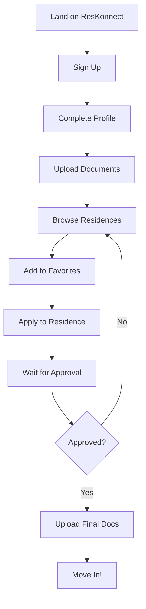
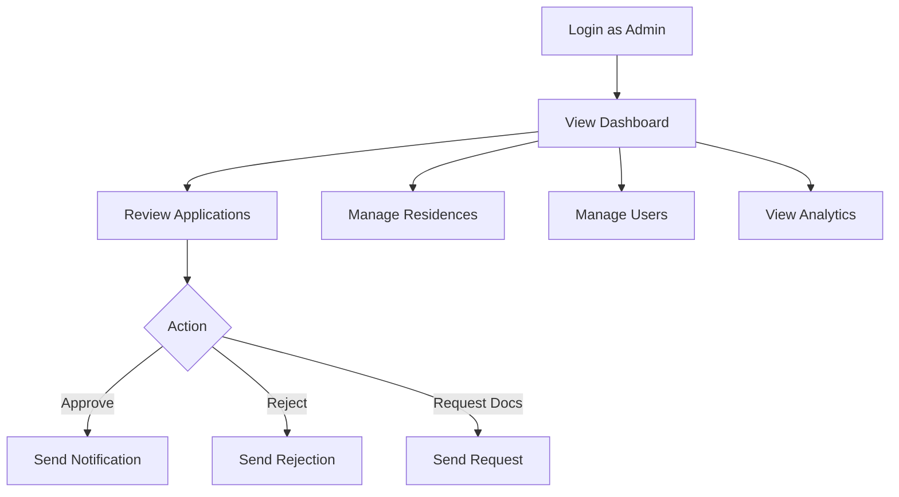

# ResKonnect Knowledge Base

> **Last Updated:** January 2026  
> **Version:** 2.0  
> **Platform:** React + Vite + Tailwind CSS + Supabase (Lovable Cloud)

---

## Table of Contents

1. [Overview](#1-overview)
2. [Tech Stack](#2-tech-stack)
3. [Project Structure](#3-project-structure)
4. [Database Schema](#4-database-schema)
5. [Authentication & Authorization](#5-authentication--authorization)
6. [Core Features](#6-core-features)
7. [User Journeys](#7-user-journeys)
8. [API Reference](#8-api-reference)
9. [Component Library](#9-component-library)
10. [Design System](#10-design-system)
11. [Business Logic](#11-business-logic)
12. [Troubleshooting](#12-troubleshooting)
13. [Roadmap](#13-roadmap)

---

## 1. Overview

### What is ResKonnect?

ResKonnect is South Africa's premier student accommodation platform, designed specifically for TUT (Tshwane University of Technology) students. It connects students with verified residences, provides NSFAS-accredited options, and offers a complete ecosystem for student life.

### Key Value Propositions

- **For Students:** Find verified, affordable accommodation near campus with transparent pricing
- **For Landlords:** Reach qualified student tenants with streamlined application management
- **For NSFAS:** Ensure students find accredited accommodation within funding limits

### Supported Campuses

| Campus | Location | Province |
|--------|----------|----------|
| Soshanguve South | Soshanguve | Gauteng |
| Soshanguve North | Soshanguve | Gauteng |
| Ga-Rankuwa | Ga-Rankuwa | Gauteng |
| Pretoria (Arcadia) | Pretoria | Gauteng |
| Mbombela | Mbombela | Mpumalanga |
| Polokwane | Polokwane | Limpopo |
| eMalahleni | eMalahleni | Mpumalanga |

---

## 2. Tech Stack

### Frontend

| Technology | Version | Purpose |
|------------|---------|---------|
| React | 18.3.1 | UI Framework |
| Vite | Latest | Build Tool |
| TypeScript | Latest | Type Safety |
| Tailwind CSS | Latest | Styling |
| shadcn/ui | Latest | UI Components |
| React Router | 6.30.1 | Routing |
| TanStack Query | 5.83.0 | Data Fetching |
| Framer Motion | - | Animations |
| Recharts | 2.15.4 | Charts |

### Backend (Lovable Cloud / Supabase)

| Technology | Purpose |
|------------|---------|
| Supabase | Database, Auth, Storage, Edge Functions |
| PostgreSQL | Database |
| Row Level Security | Data Protection |
| Lovable AI Gateway | AI-powered features |

### AI Integration

- **Model:** Google Gemini 2.5 Flash (via Lovable AI Gateway)
- **Use Cases:** ResBot chatbot, recommendations, natural language search

---

## 3. Project Structure

```
src/
├── assets/              # Static images, logos
├── components/          # Reusable UI components
│   ├── ui/             # shadcn/ui components
│   ├── admin/          # Admin-specific components
│   ├── ResBot.tsx      # AI chatbot
│   ├── NotificationCenter.tsx
│   ├── CommandPalette.tsx
│   └── SmartDashboard.tsx
├── contexts/           # React contexts
│   └── AuthContext.tsx
├── hooks/              # Custom React hooks
│   ├── useRealtimeProfile.ts
│   ├── useRealtimeApplications.ts
│   └── useRealtimeNotifications.ts
├── integrations/       # External integrations
│   └── supabase/       # Supabase client & types
├── lib/                # Utilities and constants
│   ├── utils.ts
│   ├── constants.ts
│   └── campuses.ts
├── pages/              # Route components
│   ├── admin/          # Admin pages
│   ├── seo/            # SEO landing pages
│   ├── Dashboard.tsx
│   ├── FindMyRes.tsx
│   └── ...
└── App.tsx             # Main app with routing

supabase/
├── config.toml         # Supabase configuration
├── functions/          # Edge functions
│   └── resbot-ai/      # AI chatbot backend
└── migrations/         # Database migrations
```

---

## 4. Database Schema

### Core Tables

#### `profiles`
Stores user profile information.

| Column | Type | Description |
|--------|------|-------------|
| id | UUID | Primary key (matches auth.users) |
| full_name | TEXT | User's full name |
| email | TEXT | Email address |
| phone | TEXT | Phone number |
| student_number | TEXT | University student number |
| campus | TEXT | Selected campus |
| course | TEXT | Course of study |
| year_of_study | TEXT | Year (1st, 2nd, etc.) |
| profile_picture_url | TEXT | Avatar URL |
| looking_for_roommate | BOOLEAN | Roommate finder flag |
| lifestyle_preferences | JSONB | Preferences for roommate matching |

#### `residences`
Stores accommodation listings.

| Column | Type | Description |
|--------|------|-------------|
| id | UUID | Primary key |
| name | TEXT | Residence name |
| address | TEXT | Physical address |
| campus | TEXT | Nearest campus |
| province | TEXT | Province |
| price | INTEGER | Monthly rent (ZAR) |
| room_type | TEXT | Single/Sharing/Bachelor/Commune |
| capacity | INTEGER | Total capacity |
| available_spots | INTEGER | Current availability |
| amenities | TEXT[] | List of amenities |
| images | TEXT[] | Image URLs |
| is_trusted | BOOLEAN | Verified by ResKonnect |
| featured | BOOLEAN | Featured listing |
| distance_from_campus | DECIMAL | Distance in km |
| contact_email | TEXT | Contact email |
| contact_phone | TEXT | Contact phone |
| virtual_tour_url | TEXT | 360° tour link |

#### `applications`
Tracks residence applications.

| Column | Type | Description |
|--------|------|-------------|
| id | UUID | Primary key |
| user_id | UUID | Applicant (FK to profiles) |
| residence_id | UUID | Target residence (FK) |
| status | TEXT | submitted/approved/rejected |
| notes | TEXT | Additional notes |
| application_date | TIMESTAMP | When applied |

#### `documents`
User-uploaded documents.

| Column | Type | Description |
|--------|------|-------------|
| id | UUID | Primary key |
| user_id | UUID | Owner (FK to profiles) |
| document_type | TEXT | ID/Registration/NSFAS/etc. |
| file_name | TEXT | Original filename |
| file_path | TEXT | Storage path |
| file_size | INTEGER | Size in bytes |

#### `notifications`
User notifications.

| Column | Type | Description |
|--------|------|-------------|
| id | UUID | Primary key |
| user_id | UUID | Recipient |
| type | TEXT | application/residence/alert/info |
| title | TEXT | Notification title |
| message | TEXT | Notification body |
| is_read | BOOLEAN | Read status |
| metadata | JSONB | Additional data |

#### `favorites`
Saved residences.

| Column | Type | Description |
|--------|------|-------------|
| id | UUID | Primary key |
| user_id | UUID | User |
| residence_id | UUID | Saved residence |

### Supporting Tables

- `reviews` - Residence reviews from students
- `user_roles` - Role assignments (admin/student)
- `bursaries` - Bursary/funding opportunities
- `events` - Campus events
- `campus_news` - News articles
- `student_discounts` - Discount offers
- `stores` - Marketplace stores
- `marketplace_listings` - Items for sale
- `marketplace_orders` - Purchase orders
- `store_reviews` - Store ratings
- `hero_slides` - Homepage carousel
- `platform_settings` - App configuration

---

## 5. Authentication & Authorization

### Auth Flow

1. **Sign Up:** Email/password with auto-confirm
2. **Sign In:** Email/password
3. **Session:** JWT stored in localStorage
4. **Role Check:** `user_roles` table queried for admin status

### Roles

| Role | Access Level |
|------|-------------|
| student | Student portal, applications, marketplace |
| admin | Full admin dashboard, all CRUD operations |

### Protected Routes

```tsx
// Student-only route
<ProtectedRoute>
  <Dashboard />
</ProtectedRoute>

// Admin-only route
<AdminRoute>
  <AdminDashboard />
</AdminRoute>
```

### RLS Policies

All tables have Row Level Security enabled:
- Users can only read/write their own data
- Admins have elevated access via `has_role()` function
- Public data (residences, news) readable by all

---

## 6. Core Features

### 6.1 Smart Dashboard

**Component:** `src/components/SmartDashboard.tsx`

Contextual dashboard that adapts to user's journey stage:
- **New User:** Prompts to complete profile
- **Incomplete Profile:** Shows progress, encourages completion
- **Ready User:** Suggests browsing residences
- **Active User:** Shows application status summary
- **Approved User:** Celebrates approval, shows next steps

### 6.2 AI-Powered ResBot

**Edge Function:** `supabase/functions/resbot-ai/index.ts`  
**Frontend:** `src/components/ResBot.tsx`

Features:
- Personalized responses based on user profile
- Real-time residence data queries
- Application status lookups
- NSFAS information
- Natural conversation with South African expressions
- Fallback to rule-based responses if AI unavailable

### 6.3 Notification Center

**Component:** `src/components/NotificationCenter.tsx`

- Real-time notifications via Supabase Realtime
- Unread count badge
- Mark as read / Mark all read
- Type-based icons and colors
- Links to relevant pages

### 6.4 Command Palette

**Component:** `src/components/CommandPalette.tsx`

- Keyboard shortcut: `Ctrl/Cmd + K`
- Quick navigation to any page
- Quick actions (apply, upload docs)
- Search across features

### 6.5 Residence Search

**Page:** `src/pages/FindMyRes.tsx`

Filters:
- Campus
- Price range
- Room type
- Amenities
- NSFAS accredited
- Distance from campus

Features:
- Grid/List view toggle
- Compare tool (up to 3)
- Favorites
- Virtual tour links

### 6.6 Application System

**Page:** `src/pages/Applications.tsx`

- View all applications
- Status tracking (submitted/approved/rejected)
- Document status per application
- Real-time status updates

### 6.7 Marketplace

**Pages:** `src/pages/Marketplace.tsx`, `src/pages/MyStore.tsx`

- Student-to-student sales
- Store creation
- Product listings
- Order management
- Store reviews

### 6.8 Document Management

**Page:** `src/pages/Documents.tsx`

- Upload ID, registration, NSFAS letter
- Document type categorization
- Progress tracking
- Secure storage in Supabase

---

## 7. User Journeys

### New Student Journey



### Admin Journey



---

## 8. API Reference

### Edge Functions

#### `resbot-ai`

AI-powered chatbot endpoint.

**Request:**
```json
POST /functions/v1/resbot-ai
{
  "message": "What residences are near Soshanguve?",
  "userId": "uuid-here"
}
```

**Response:**
```json
{
  "response": "I found 5 residences near Soshanguve..."
}
```

**Error Response:**
```json
{
  "error": "Rate limit exceeded",
  "fallback": "I'm busy right now, try the filters..."
}
```

### Supabase Queries (Common)

```typescript
// Get user profile
const { data } = await supabase
  .from('profiles')
  .select('*')
  .eq('id', userId)
  .single();

// Get residences with filters
const { data } = await supabase
  .from('residences')
  .select('*')
  .eq('campus', 'Soshanguve')
  .gte('price', 2000)
  .lte('price', 4000)
  .gt('available_spots', 0);

// Submit application
const { error } = await supabase
  .from('applications')
  .insert({
    user_id: userId,
    residence_id: residenceId,
    status: 'submitted'
  });
```

---

## 9. Component Library

### Layout Components

| Component | Path | Description |
|-----------|------|-------------|
| DashboardLayout | `components/DashboardLayout.tsx` | Main dashboard wrapper with sidebar |
| PublicLayout | `components/PublicLayout.tsx` | Public pages wrapper |
| AdminLayout | `components/admin/AdminLayout.tsx` | Admin dashboard wrapper |

### Smart Components

| Component | Path | Description |
|-----------|------|-------------|
| SmartDashboard | `components/SmartDashboard.tsx` | Contextual dashboard section |
| ResBot | `components/ResBot.tsx` | AI chatbot |
| NotificationCenter | `components/NotificationCenter.tsx` | Notifications popover |
| CommandPalette | `components/CommandPalette.tsx` | Quick navigation |

### UI Components (shadcn/ui)

All in `components/ui/`:
- Button, Card, Dialog, Sheet
- Input, Textarea, Select
- Table, Tabs, Accordion
- Toast, Alert, Badge
- Progress, Skeleton
- And more...

---

## 10. Design System

### Colors (HSL in index.css)

```css
:root {
  --background: 0 0% 100%;
  --foreground: 222.2 84% 4.9%;
  --primary: 222.2 47.4% 11.2%;
  --primary-foreground: 210 40% 98%;
  --secondary: 210 40% 96%;
  --muted: 210 40% 96%;
  --accent: 210 40% 96%;
  --destructive: 0 84.2% 60.2%;
  --success: 142 76% 36%;
}
```

### Typography

- **Headings:** Font-weight 600-700, tracking-tight
- **Body:** text-sm to text-base
- **Muted:** text-muted-foreground

### Spacing

Standard Tailwind spacing: 4, 6, 8 for gaps; p-4, p-6 for padding.

### Shadows

```css
.shadow-premium {
  box-shadow: 0 4px 6px -1px rgba(0,0,0,.1), 0 2px 4px -1px rgba(0,0,0,.06);
}
```

---

## 11. Business Logic

### Application Status Flow

```
submitted → under_review → approved/rejected
                        ↓
                  documents_required → submitted (resubmit)
```

### Profile Completion Calculation

```typescript
const fields = [
  { name: 'full_name', weight: 20 },
  { name: 'student_number', weight: 20 },
  { name: 'phone', weight: 15 },
  { name: 'campus', weight: 15 },
  { name: 'course', weight: 10 },
  { name: 'year_of_study', weight: 10 },
  { name: 'id_copy_status', weight: 5 },
  { name: 'proof_of_registration_status', weight: 5 },
];
// Sum weights of completed fields
```

### Contact Routing

All residence inquiries route through ResKonnect's WhatsApp:
```typescript
const RESKONNECT_WHATSAPP = "27656438"; // Formatted number
```

---

## 12. Troubleshooting

### Common Issues

| Issue | Cause | Solution |
|-------|-------|----------|
| "Supabase environment variables not set" | Missing .env | Ensure VITE_SUPABASE_URL and VITE_SUPABASE_PUBLISHABLE_KEY are set |
| Profile picture not uploading | RLS policy | Check `profile-pictures` bucket policies |
| ResBot not responding | Rate limit or AI error | Falls back to rule-based responses |
| Notifications not updating | Realtime not subscribed | Check channel subscription |

### Debugging Steps

1. **Check Console:** Browser DevTools → Console
2. **Check Network:** DevTools → Network for API errors
3. **Check Supabase Logs:** Edge function logs in Cloud dashboard
4. **Check RLS:** Ensure policies allow the operation

---

## 13. Roadmap

### Phase 1 (Completed)
- [x] Smart Dashboard with contextual sections
- [x] AI-powered ResBot
- [x] Notification Center
- [x] Command Palette

### Phase 2 (Next)
- [ ] Smart residence recommendations
- [ ] Natural language search
- [ ] Document intelligence (validation, expiry tracking)

### Phase 3 (Future)
- [ ] Onboarding wizard
- [ ] Campus-specific features
- [ ] Push notifications
- [ ] Email digests
- [ ] Roommate matching algorithm

---

## Contact

- **Support:** support@reskonnect.co.za
- **WhatsApp:** [ResKonnect Support](https://wa.me/27656438)

---

*This knowledge base is maintained as part of the ResKonnect codebase. Update as features are added or changed.*
