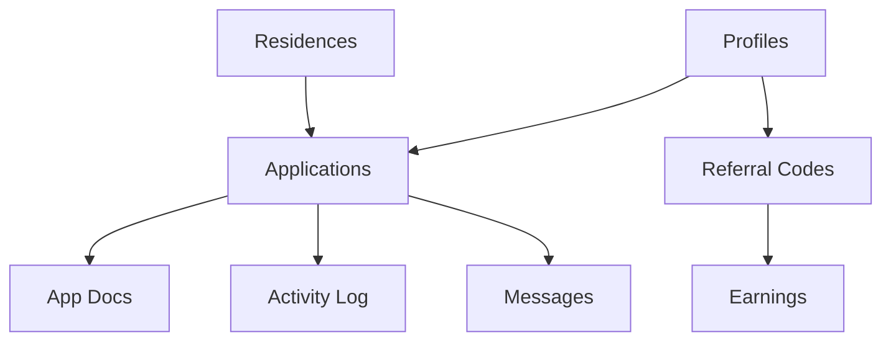

# 13. Database Relationships

## 1. Core Data Flow

## 2. Table Detail & Constraints

### Profile Chain
- `profiles.id` (Primary Key)
- `user_roles.user_id` -> `profiles.id` (CASCADE)
- `notifications.user_id` -> `profiles.id` (CASCADE)

### Application Chain
- `applications.user_id` -> `profiles.id`
- `applications.residence_id` -> `residences.id`
- `application_documents.application_id` -> `applications.id` (CASCADE)
- `application_activity_log.application_id` -> `applications.id` (CASCADE)

### Referral Chain
- `referral_codes.user_id` -> `profiles.id` (UNIQUE)
- `referral_earnings.referrer_user_id` -> `profiles.id`
- `referral_earnings.referred_user_id` -> `profiles.id`

## 3. Critical Triggers
- `on_auth_user_created`: Creates `profiles` entry.
- `update_updated_at`: Standard timestamp management.
- `enforce_marketplace_seller`: Security check for orders.

## 4. Primary Indexes
- `idx_residences_institution_tags`: GIN index for fast filtering.
- `idx_applications_user_residence`: Composite for quick status checks.
- `idx_profiles_email`: Unique index for auth.
