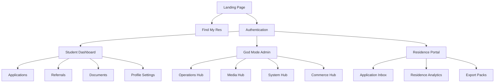

# 15. System Map

## 1. User Navigation Flow

## 2. Platform Hierarchy
- **Super Admin (ResKonnect HQ)**
  - Oversees all Residences, Users, and Content.
  - Manages platform-wide `platform_settings`.
- **Residence Admin (Partners)**
  - Operates their specific buildings.
  - Reviews student documents and confirms move-ins.
- **Institutions (Universities/TVETs)**
  - Future: Direct access to accreditation stats and handover packs.
- **Students (Customers)**
  - The primary consumers of the housing marketplace and student services.
